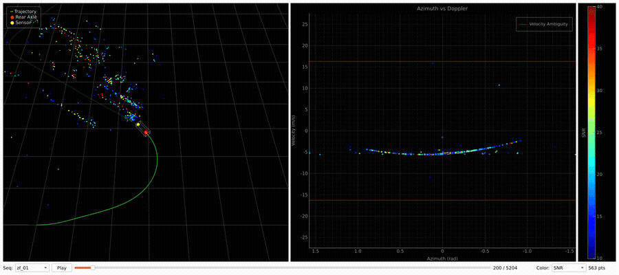

# ZF FRGen21 Automotive Radar Dataset

Automotive radar point clouds with GNSS/INS ground-truth trajectories, recorded
with a ZF FRGen21 77 GHz imaging radar (front-center mounted) on public roads.
The dataset contains **6 sequences**, ~**78,000 radar frames**, ~**51 km** and
~**2 hours** of driving.



## Sequences

| Sequence | Frames | Duration | Distance | Avg. points/frame |
|----------|-------:|---------:|---------:|------------------:|
| zf_01    |  5,205 |  7.8 min |  3.1 km  | 690 |
| zf_02    | 10,914 | 16.4 min |  4.9 km  | 381 |
| zf_03    |  7,548 | 11.3 min |  6.7 km  | 589 |
| zf_04    | 14,971 | 22.5 min | 10.5 km  | 604 |
| zf_05    | 17,717 | 26.6 min | 10.9 km  | 532 |
| zf_06    | 21,643 | 32.5 min | 14.9 km  | 513 |

## Directory layout

```
ZF_Dataset/
├── extrinsics.csv          # sensor-to-vehicle extrinsics (shared by all sequences)
├── zf_01/
│   ├── ground_truth.csv    # vehicle pose + velocity, one row per radar frame
│   └── radar/
│       ├── frame_000000.pcd
│       ├── frame_000001.pcd
│       └── ...
├── zf_02/
└── ...
```

## Coordinate conventions

- **Sensor frame (SCS):** x forward, y left, z up (right-handed).
  Azimuth is positive to the **left** (`azimuth = atan2(y, x)`), elevation
  positive **up** (`elevation = arcsin(z / range)`).
- **Vehicle frame:** origin at the **center of the rear axle** (GNSS/INS
  reference point), axes aligned with the sensor frame convention.
- **World frame:** local frame anchored at the vehicle pose of the first
  frame of each sequence (first pose is the identity).

## Radar frames (`radar/frame_XXXXXX.pcd`)

ASCII PCD v0.7 files, one per radar scan (~11.1 Hz frame rate). Two metadata
lines precede the standard PCD header:

```
# .PCD v0.7 - Point Cloud Data file format
# timestamp_ns 1624006954674470229
# velocity_ambiguity 32.499187
...
FIELDS x y z range azimuth elevation velocity rcs power snr
...
DATA ascii
```

| Metadata | Description |
|----------|-------------|
| `timestamp_ns` | Absolute start time of the radar measurement, in nanoseconds |
| `velocity_ambiguity` | Width of the unambiguous Doppler interval in m/s (see below) |

| Field | Unit | Description |
|-------|------|-------------|
| `x`, `y`, `z` | m | Cartesian position in the sensor frame (derived from range/azimuth/elevation) |
| `range` | m | Radial distance |
| `azimuth` | rad | Horizontal angle, positive left |
| `elevation` | rad | Vertical angle, positive up |
| `velocity` | m/s | Radial (Doppler) velocity, **negative = approaching** |
| `rcs` | dBsm | Radar cross-section |
| `power` | – | Received power (linear, arbitrary units) |
| `snr` | dB | Signal-to-noise ratio |

**Doppler ambiguity.** Measured radial velocities wrap into the interval
±`velocity_ambiguity`/2. The sensor alternates between two scan modes on
consecutive frames with different ambiguity ranges (≈32.5 and ≈43.6 m/s),
so the unambiguous interval changes frame to frame — always read it from the
frame header. Observed field of view is roughly ±50° azimuth, ±15° elevation,
with detections out to ~100 m.

> ⚠️ **Generic PCD readers (Open3D, PCL) return only `x`/`y`/`z`** and
> silently drop the radar fields (`velocity`, `snr`, …) and the comment-line
> metadata — including `velocity_ambiguity`, without which wrapped Doppler
> velocities cannot be interpreted. Use a header-aware reader:

```python
import numpy as np

def load_radar_pcd(path):
    meta, fields, n, skip = {}, [], 0, 0
    with open(path) as f:
        for line in f:
            skip += 1
            if line.startswith("# ") and len(line.split()) == 3:
                key, val = line.split()[1:]
                meta[key] = int(val) if val.isdigit() else float(val)
            elif line.startswith("FIELDS"):
                fields = line.split()[1:]
            elif line.startswith("POINTS"):
                n = int(line.split()[1])
            elif line.startswith("DATA"):
                break
    data = np.loadtxt(path, skiprows=skip, max_rows=n, ndmin=2)
    return {f: data[:, i] for i, f in enumerate(fields)}, meta

points, meta = load_radar_pcd("zf_01/radar/frame_000000.pcd")
v_amb = meta["velocity_ambiguity"]   # Doppler wraps into ±v_amb/2
doppler = points["velocity"]         # m/s, negative = approaching
```

This repo ships the same reader (plus pose/extrinsics/sequence helpers) as a
numpy-only package — `pip install .` then `from zf_radar import load_pcd,
load_poses, load_extrinsics, discover_sequences`.

## Ground truth (`ground_truth.csv`)

GNSS/INS (OXTS) ground truth sampled at the radar frame timestamps.
The first line of the file is a **header row** (`t,T00,…,wz`); every line
after it is **one data row per radar frame**, so data row *i* corresponds to
`frame_%06i.pcd` (the file has exactly `num_frames + 1` lines). KITTI-style
format, 19 comma-separated columns:

| Columns | Description |
|---------|-------------|
| `t` | Frame timestamp in seconds, relative to the sequence start |
| `T00 … T23` | Vehicle-to-world pose: 3×4 transform `[R | t]`, row-major |
| `vx, vy, vz` | Linear velocity in the **vehicle body frame**, m/s |
| `wx, wy, wz` | Angular velocity in the vehicle body frame, rad/s |

```python
import numpy as np

data = np.loadtxt("zf_01/ground_truth.csv", delimiter=",", skiprows=1)
T = np.zeros((len(data), 4, 4))
T[:, :3, :4] = data[:, 1:13].reshape(-1, 3, 4)
T[:, 3, 3] = 1.0                      # (N, 4, 4) vehicle -> world
v_body, w_body = data[:, 13:16], data[:, 16:19]
```

## Extrinsics (`extrinsics.csv`)

Sensor-to-vehicle transform in the same 3×4 row-major format (`T00 … T23`),
shared by all sequences. Like the ground truth, the file has a header row
followed by a single data row. The radar is mounted **3.925 m ahead of the rear
axle** at the front bumper. To project a radar point `p` (sensor frame) into
the world frame of frame `i`:

```python
p_world = T[i] @ T_sensor_vehicle @ [x, y, z, 1]
```

## Visualizer

An interactive Qt viewer (`visualizer.py`) shows the point cloud in the world
frame alongside an azimuth–Doppler plot with the per-frame ambiguity bounds.

```bash
# from a checkout:
pip install -r requirements.txt   # numpy, PyQt6, pyqtgraph, PyOpenGL
python visualizer.py -p /path/to/ZF_Dataset

# or installed as a package (the [viz] extra pulls in the GUI stack):
pip install ".[viz]"
zf-radar-viz -p /path/to/ZF_Dataset
```

| Control | Action |
|---------|--------|
| `Seq` dropdown | Switch sequence |
| Play / `Space` | Toggle playback |
| `←` / `→` | Step one frame |
| Slider | Scrub through the sequence |
| `Color` dropdown | Color points by SNR or RCS |
| Mouse drag / wheel | Orbit / zoom the 3D view |
| `Ctrl+C` (terminal) | Quit |

The 3D view shows the ground-truth trajectory (solid = traversed, faded =
upcoming), the rear-axle and sensor positions, and the ego-vehicle outline.
The azimuth–Doppler plot uses a driver's-eye orientation (targets to the
right of the vehicle appear on the right).

## License & citation

*(to be added)*
